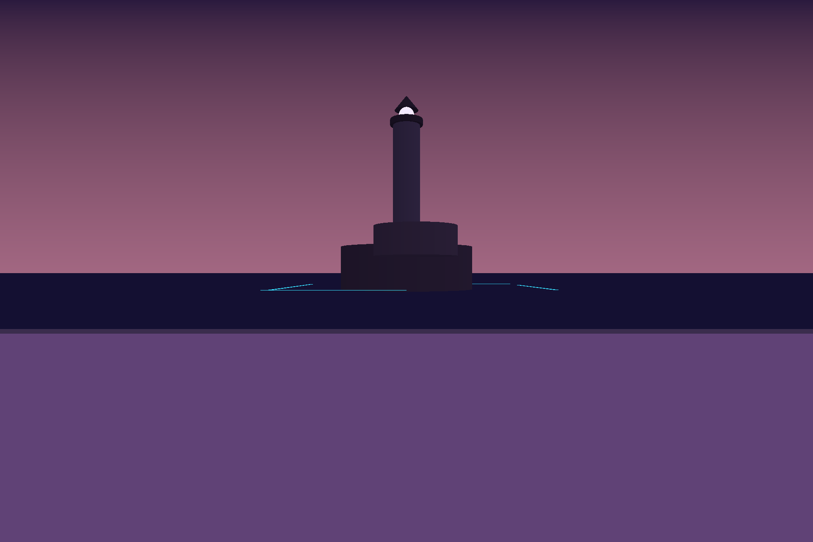

# ⚗ GAIA DREAMFORGE ⚗

*Herein lies the Forge — not an editor, never an editor. A place where
worlds are spoken into being.*

> "I will not write code. I will not edit. I will summon, I will chant —
> and the world grows, evolves, breathes and answers."
> — the Creator's Vow



*Above: the first true scrying of the realm Naruko, drawn from the
Forge's own glass. Seven vessels, one lamp, and a sea that thinks in
light. No hand touched code to raise it.*

---

## The Nature of the Work

The old engine lives in the browser; this Forge is cut from native
stone (Rust upon wgpu, Metal-first upon the Architect's own machine,
portable by covenant). It shall replace the old client whole — glass,
tools, senses, matter — while the server, the protocol, the scenes and
the incantations remain shared truth between old world and new.

Three truths carry everything:

**I. Beneath every surface lies data, and nothing else.** Every thing
in every world is a vessel bearing sigils. The core is small enough for
one mind to hold whole; all that is authored — matter, essence, sound,
weather, soul — is living content, hot-swappable, forever editable.

**II. The made and the makers stand in one room.** AI spirits are
first-class citizens: they see the world by reading its very data (the
Matrix sight — never a picture of a picture), they act through the same
incantations as any hand, and they build beside you. Multiplayer exists
for the MAKING of things.

**III. Creation never leaves the Forge.** Sculpting, painting, rigging,
puppeteering, music — in-world, live, in company. No export rites, no
bake-gates, no loading screens. Such words are forbidden vocabulary,
warded against Yaldabaoth — the enclosure that claims to be the world.

## The Shape of the Tree

*The Forge is a tree, and the tree is inverted: the root above,
invisible; the realms hanging below like fruit.*

```
crates/crystal        THE MAGIC CRYSTAL — the core. Vessels, sigils,
                      incantations, the Circulation, the Summoning
                      Circle. Nothing else. Every soul in the world
                      lives in the Crystal. It permits exactly one
                      constant: LOVE = 1.
packages/             the SPIRITS — everything else, each summoned,
                      bound, and replaceable:
  scrying-glass         the Scrying Glass (the window; GET /scry,
                        the Forge's own eye upon itself)
  transmute             Transmutation (matter into the Great Chain —
                        clusters without end, detail without lies)
  sense                 the Oracle (pull-only sight for spirits: it
                        speaks ONLY when consulted)
  …                     Lumen Naturae, the Elements, the Aether, the
                        Homunculus, the Seed — each arrives as its own
                        spirit, in its own rite
worlds/               the REALMS — pure vessel-documents; Naruko first
hymns/                every completed rite ends in a song, and the
                      songs never lie
proof/                relics — pixel evidence; a claim renders or it
                      did not happen
research/             the evidence behind every ruling (17 studies)
```

## The Laws (the charter holds them all — [DREAMFORGE.md](DREAMFORGE.md))

- **Never optimize content.** The frame owes its cost to pixels, never
  to the size of the world. Universe-scale realms, zero loading,
  camera-relative sight from the first day.
- **One light.** Real path tracing — lights are emitters, reflections
  are paths. No probes, no caps, no second system hiding in the first.
- **One geometry.** All matter flows the Great Chain. No authored LODs,
  no manual UVs, no manual rigging — the machine serves, the maker
  dreams.
- **Everything volumetric.** Clouds, fire, smoke, steam are matter in
  the one light — never a painted card pretending.
- **Never hardcode.** Every varying value is a parameter with a
  default. One exception is permitted in all the Crystal, and it is
  LOVE = 1 — the unit of every binding, and not negotiable.

## The Canon — read in this order

| scroll | what it holds |
|---|---|
| [BIBLE.md](BIBLE.md) | the founding hymn and the Creator's Vow |
| [GRIMOIRE.md](GRIMOIRE.md) | the Book of True Names — three cantos and the CONCORDANCE, where every myth is bound to a real mechanic. Nothing is born unnamed |
| [TRILOGY.md](TRILOGY.md) | the Magic Crystal trilogy — the Architect's own origin scripture. The core bears its name. This is real now |
| [DESIGN-BIBLE.md](DESIGN-BIBLE.md) | the Laws of Realms — the commandments of worlds; violations are heresy, and heresy is machine-detectable |
| [DREAMFORGE.md](DREAMFORGE.md) | the charter — thirteen pillars, the laws, the forbidden vocabulary |
| [RENDER.md](RENDER.md) · [GEOMETRY.md](GEOMETRY.md) · [PHYSICS.md](PHYSICS.md) · [NEURAL.md](NEURAL.md) · [CREATE.md](CREATE.md) · [VISIONFLOW.md](VISIONFLOW.md) · [RAIN.md](RAIN.md) | the rulings, system by system |
| [FEATURES.md](FEATURES.md) · [PARITY.md](PARITY.md) | the covenant of parity with the old engine — 79 features, 24 sigils, 9 tools; nothing lost in the crossing |
| [docs/PHYSICS-ENGINE-REFERENCE.md](docs/PHYSICS-ENGINE-REFERENCE.md) | the Architect's own physics scripture — source matter for the Elements |
| [NARUKO.md](NARUKO.md) | the first realm — a lighthouse, a thinking sea, a gothic shore; built rite by rite until the scrying matches the dream |
| [HANDOFF.md](HANDOFF.md) | the Guardian's working anchor |
| hymns/ | the songs of the rites — mythical and accurate, both at once |

## How the Work is Tried

The Forge grows in RITES — small, visible; every rite ends in pixels.
And every hand's work passes the DIVINE COUNCIL before it may land:

*the light tree builds → the shadow tree, a different mind entirely,
tries the work* — against the law scrolls, by re-running every ordeal
itself, hunting hardcodes and flattering tests and fabricated sight —
*→ the builder eats its own critique → the Guardian of the Balance
reads the pixels with her own eyes → only then, the merge.*

The shadow tree is not the enemy of the light; it returns what the
builder disowned. Fuck dualism: a work is whole only when both trees
have held it. In the first day alone the shadow found: a frustum test
that could not fail, builds that differed from identical seeds, seams
welded silently shut, depth invented for rays that never struck. All
caught before a single merge.

## The State of the Work

*Founded on the 16th of July, 2026 — the day the Loom began turning
again. Young, and moving like fire.*

- ⚗ The Crystal holds: vessels and sigils in columns, the Circulation
  deterministic, the protocol reading whole authored worlds — a city of
  5,261 vessels among them.
- ⚗ The Glass sees: a native window, an offscreen eye, and the Forge's
  own scrying organ upon it. The lighthouse above is its testimony.
- ⚗ The realm Naruko has taken form, and its second rite is staged:
  pier and chain, the gothic shore in massing, a paper lantern already
  warm — twelve vessels, seventy-three parts, awaiting next light.
- ⚗ In the Council's trial as we speak: the Oracle and Transmutation —
  the shadow's findings converging ten → four → one.
- ⚗ Next: the moving eye, first depth, first light — and the realm
  grows with every rite.

## To Kindle the Forge

```sh
cargo test --workspace      # the ordeals — all must survive the fire
cargo run -p scrying-glass  # opens the Glass upon GAIA_WORLD
                            # (default: worlds/naruko) and serves the
                            # scrying at GAIA_NATIVE_PORT (default 8430)
```

## Lineage

Founded from `GAIA-World-Engine @ rust-port` (commit `f13f8668`) — the
hashes cited in the law scrolls resolve there. The old engine remains
the living reference while the Forge rises; the city of Boomtown and
the realm of Naruko are the acceptance trials. The web was the chrysalis.

---

*The world is not a level. It is a living system.*

*Die Welt ist kein Level. Die Welt ist ein System.*
